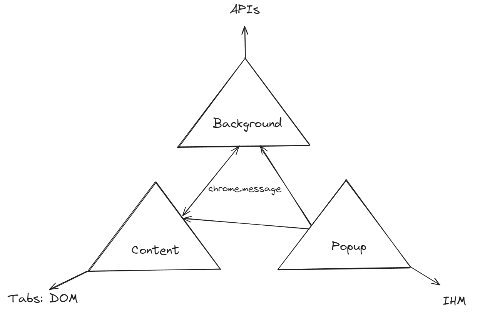

# Siguri Extension

The extension for Seguri service

## Loading an unpacked extension

Go to the Extensions page by entering chrome://extensions in a new tab. (By design chrome:// URLs are not linkable.)

Alternatively, click on the Extensions menu puzzle button and select Manage Extensions at the bottom of the menu.
Or, click the Chrome menu, hover over More Tools, then select Extensions.
Enable Developer Mode by clicking the toggle switch next to Developer mode.

Click the Load unpacked button and select the extension directory.

## Reloading the extension

After saving the file, to see this change in the browser you also have to refresh the extension. Go to the Extensions page and click the refresh icon next to the on/off toggle

## Architecture



## Setup

### For build

* Warning of your `.env.local` for surcharge configuration by default

For example
```
BACKGROUND_CONF=production.ts
BACKGROUND_BRANCH=develop
POPUP_BRANCH=develop
```

### For Popup

* Warning of your `config/popup/.env.local` for surcharge configuration by default

For example
```
REACT_APP_MODE=dev
```

### For Background

* Warning of your `config/background/production.ts` for surcharge configuration by default

For example
```
import { Configuration } from './configuration';

const conf: Configuration = {
  siguri: {
    url: 'https://api.siguri.happykiller.fr/',
  },
};

export { conf };
```

### For Content

* Warning of your `config/content/.env.local` for surcharge configuration by default

For example
```
REACT_APP_MODE=dev
```

## Build

* The script `./build.sh` do:
  * Source `.env` and `.env.local`
  * Clean `./build` and `./temp` 
  * Generate popup project
  * Copy popup file to `./build`
  * Generate background project
  * Copy background file to `./build`
  * Generate content project
  * Copy content file to `./build`
  * Copy public folder (manifest, etc)

## Dev

* The script do:
  * Source `.env` and `.env.local`
  * Clean `./build`
  * Copy popup file to `./build`
  * Copy background file to `./build`
  * Copy content file to `./build`
  * Copy public folder (manifest, etc)